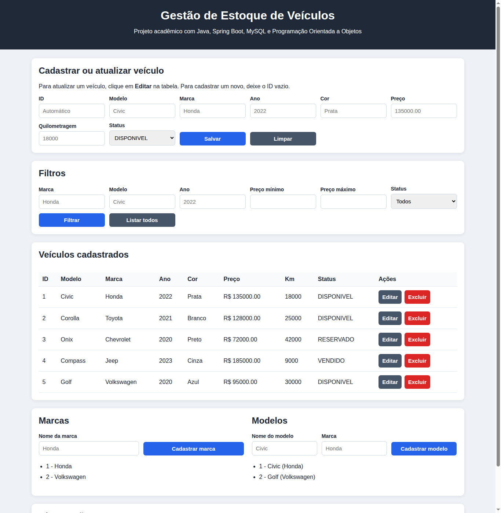
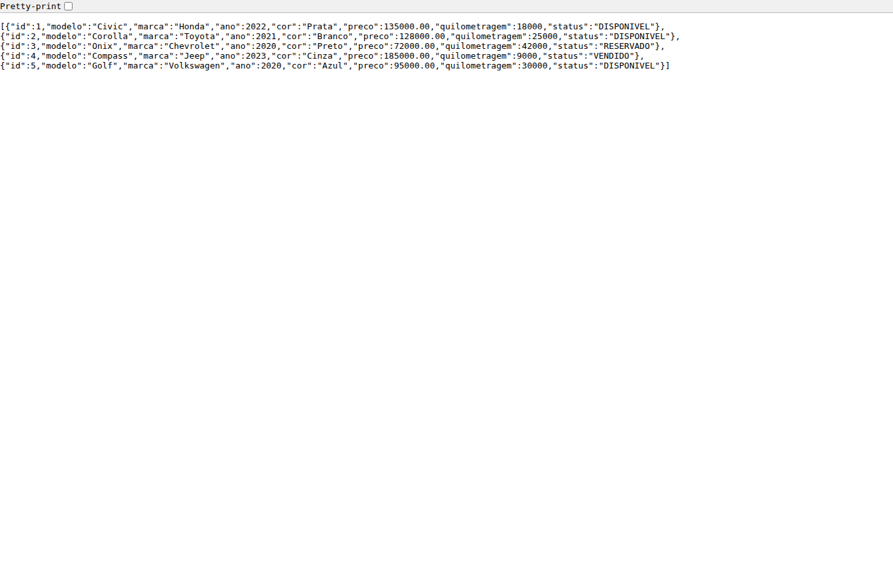
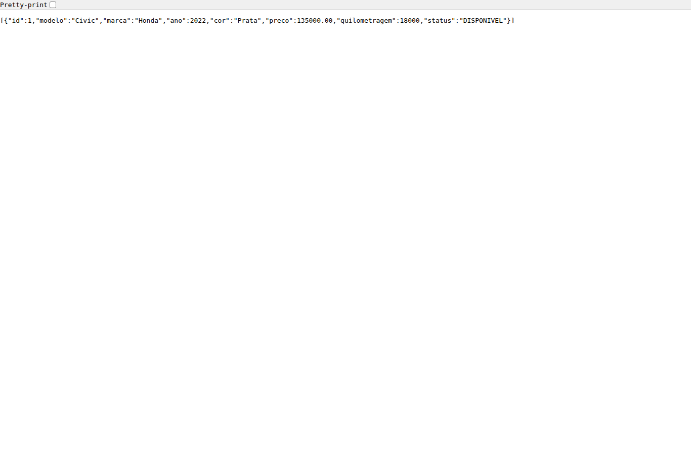
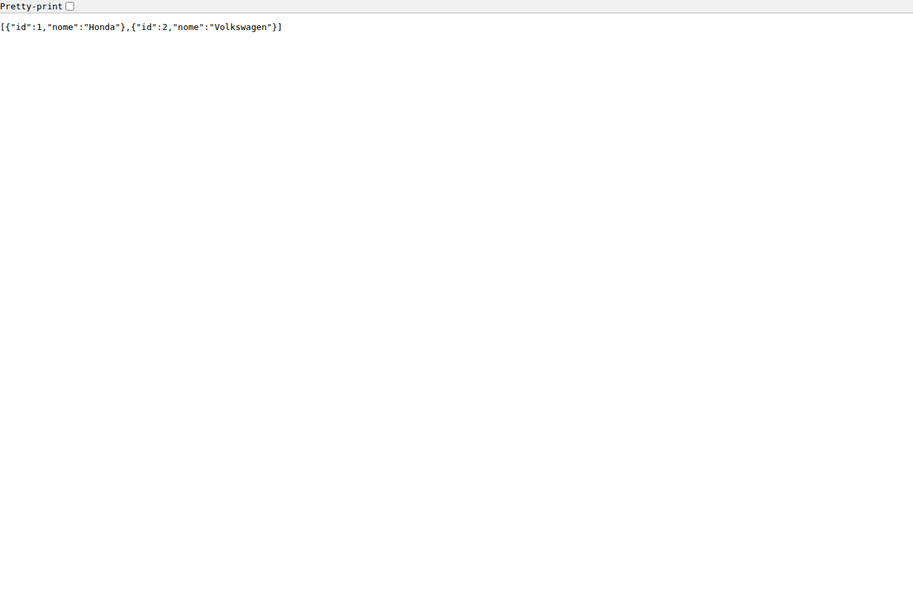
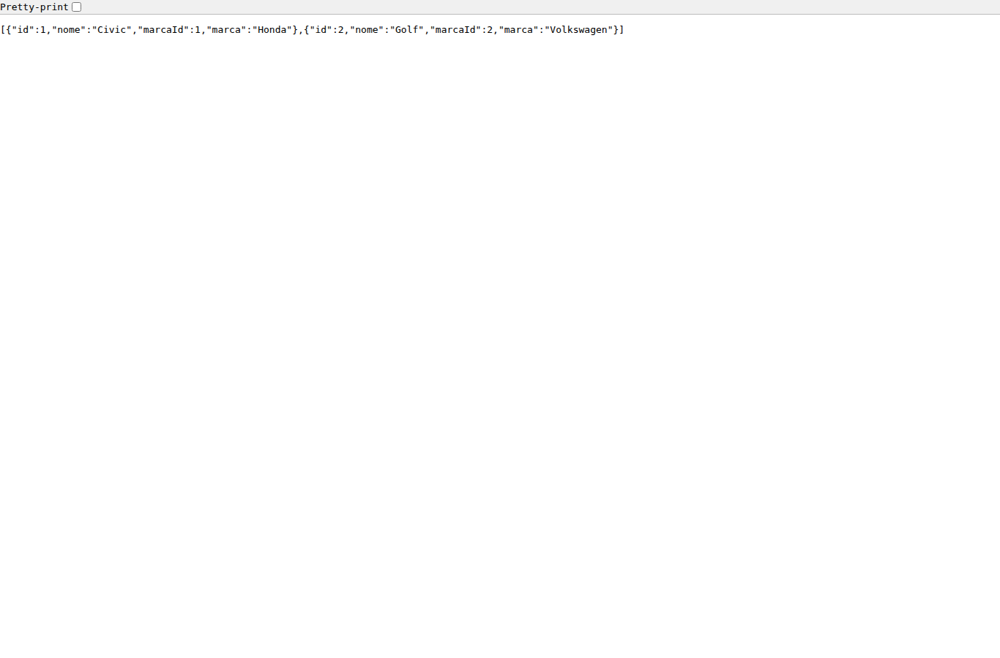

# Sistema Automotivo - Gestão de Estoque de Veículos

Sistema acadêmico desenvolvido para gerenciamento de estoque de veículos em uma concessionária. A aplicação possui backend em Java com Spring Boot, persistência em MySQL e uma interface web simples para demonstração das funcionalidades.

## Objetivo

O objetivo do projeto é organizar o cadastro e a consulta de veículos disponíveis em estoque, permitindo registrar informações como modelo, marca, ano, cor, preço, quilometragem e status de disponibilidade.

O sistema também permite cadastrar marcas e modelos, associando cada modelo à sua respectiva marca.

## Tecnologias utilizadas

- Java 21
- Spring Boot
- Spring Web
- Spring Data JPA
- Bean Validation
- MySQL
- Maven
- HTML, CSS e JavaScript
- H2 Database para testes automatizados

## Funcionalidades

- Cadastro de veículos
- Listagem de veículos
- Busca de veículo por ID
- Atualização de veículo
- Exclusão de veículo
- Filtro de veículos por:
  - marca
  - modelo
  - ano
  - faixa de preço
  - status
- Cadastro de marcas
- Cadastro de modelos
- Associação entre marcas e modelos
- Validação dos dados de entrada
- Tratamento padronizado de erros
- Criação automática das tabelas pelo JPA/Hibernate
- Interface web simples para demonstração do sistema

## Dados do veículo

Cada veículo possui os seguintes campos:

- `id`
- `modelo`
- `marca`
- `ano`
- `cor`
- `preco`
- `quilometragem`
- `status`

Os status permitidos são:

- `DISPONIVEL`
- `VENDIDO`
- `RESERVADO`

## Estrutura do projeto

```text
src
|-- main
|   |-- java
|   |   `-- br/com/estoque/veiculos
|   |       |-- config
|   |       |-- controller
|   |       |-- dto
|   |       |-- entity
|   |       |-- exception
|   |       |-- repository
|   |       |-- service
|   |       `-- EstoqueVeiculosApplication.java
|   `-- resources
|       |-- static
|       |   `-- index.html
|       `-- application.properties
`-- test
    |-- java
    `-- resources
```

## Organização das camadas

- `config`: configurações gerais da aplicação.
- `controller`: camada responsável por receber as requisições HTTP.
- `dto`: objetos usados para entrada e saída de dados da API.
- `entity`: classes que representam as tabelas do banco de dados.
- `exception`: classes responsáveis pelo tratamento de erros.
- `repository`: interfaces de acesso ao banco de dados com Spring Data JPA.
- `service`: camada onde ficam as regras de negócio.
- `static`: arquivos da interface web.
- `resources`: arquivos de configuração da aplicação.

## Principais classes

- `EstoqueVeiculosApplication`: classe principal que inicia a aplicação.
- `VeiculoController`: controller dos endpoints de veículos.
- `MarcaController`: controller dos endpoints de marcas.
- `ModeloController`: controller dos endpoints de modelos.
- `VeiculoService`: regras de negócio relacionadas aos veículos.
- `MarcaService`: regras de negócio relacionadas às marcas.
- `ModeloService`: regras de negócio relacionadas aos modelos.
- `Veiculo`: entidade que representa a tabela de veículos.
- `Marca`: entidade que representa a tabela de marcas.
- `Modelo`: entidade que representa a tabela de modelos.
- `StatusVeiculo`: enum com os status disponíveis para um veículo.
- `GlobalExceptionHandler`: tratamento global de erros da API.

## Como a aplicação funciona

O fluxo principal da aplicação segue a arquitetura em camadas:

```text
Interface web / Postman
        ↓
Controller
        ↓
Service
        ↓
Repository
        ↓
MySQL
```

1. O usuário acessa a interface web ou envia uma requisição pelo Postman.
2. O controller recebe a requisição.
3. Os dados são validados pelos DTOs.
4. O service executa as regras de negócio.
5. O repository acessa o banco de dados.
6. O resultado é retornado em formato JSON ou exibido na interface web.

## Conceitos de Programação Orientada a Objetos aplicados

- Classes para representar entidades do domínio, como `Veiculo`, `Marca` e `Modelo`.
- Encapsulamento por meio de atributos privados e métodos de acesso.
- Métodos de comportamento nas entidades, como criação e atualização de dados.
- Uso de enum (`StatusVeiculo`) para limitar os valores possíveis do status.
- Associação entre objetos, pois um `Modelo` pertence a uma `Marca`.
- Separação de responsabilidades entre controller, service, repository, DTO e entity.
- Uso de interfaces nos repositories, aplicando abstração no acesso aos dados.

## Requisitos para executar

- Java 21 instalado
- Maven instalado
- MySQL instalado e em execução

## Configuração do MySQL

Crie o banco de dados no MySQL:

```sql
CREATE DATABASE IF NOT EXISTS estoque_veiculos;
```

O arquivo `src/main/resources/application.properties` contém a configuração de conexão:

```properties
spring.datasource.url=jdbc:mysql://127.0.0.1:3306/estoque_veiculos?createDatabaseIfNotExist=true&useSSL=false&serverTimezone=UTC&allowPublicKeyRetrieval=true
spring.datasource.username=root
spring.datasource.password=sua_senha_do_mysql
spring.jpa.hibernate.ddl-auto=update
```

O Hibernate cria e atualiza automaticamente as tabelas do banco ao iniciar a aplicação.

## Como executar o projeto

No terminal, dentro da pasta do projeto, execute:

```bash
mvn clean install
```

Depois execute:

```bash
mvn spring-boot:run
```

Quando a aplicação iniciar, será exibida uma mensagem semelhante a:

```text
Tomcat started on port 8080
```

## Como acessar o sistema

Interface web:

```text
http://localhost:8080/
```

API de veículos em JSON:

```text
http://localhost:8080/veiculos
```

## Capturas de tela

### Interface principal



### Listagem de veículos pela API



### Filtro de veículos por marca



### Listagem de marcas



### Listagem de modelos



## Documentos gerados

- [Relatório acadêmico em PDF](docs/relatorio-gestao-estoque-veiculos.pdf)
- [PDF com prints do sistema funcionando](docs/prints-sistema-funcionando.pdf)
- [Vídeo pitch sem voz](docs/video-pitch-sem-voz.mp4)
- [Vídeo pitch com narração](docs/video-pitch-com-voz.mp4)

## Endpoints da API

### Veículos

| Método | Endpoint | Descrição |
| --- | --- | --- |
| POST | `/veiculos` | Cadastra um veículo |
| GET | `/veiculos` | Lista todos os veículos |
| GET | `/veiculos/{id}` | Busca um veículo por ID |
| PUT | `/veiculos/{id}` | Atualiza um veículo |
| DELETE | `/veiculos/{id}` | Exclui um veículo |
| GET | `/veiculos/filtro` | Filtra veículos |

### Marcas

| Método | Endpoint | Descrição |
| --- | --- | --- |
| POST | `/marcas` | Cadastra uma marca |
| GET | `/marcas` | Lista todas as marcas |
| GET | `/marcas/{id}` | Busca uma marca por ID |
| PUT | `/marcas/{id}` | Atualiza uma marca |
| DELETE | `/marcas/{id}` | Exclui uma marca |

### Modelos

| Método | Endpoint | Descrição |
| --- | --- | --- |
| POST | `/modelos` | Cadastra um modelo |
| GET | `/modelos` | Lista todos os modelos |
| GET | `/modelos?marcaId={id}` | Lista modelos de uma marca |
| GET | `/modelos/{id}` | Busca um modelo por ID |
| PUT | `/modelos/{id}` | Atualiza um modelo |
| DELETE | `/modelos/{id}` | Exclui um modelo |

## Exemplos para testar no Postman

### Cadastrar veículo

```text
POST http://localhost:8080/veiculos
```

Body:

```json
{
  "modelo": "Civic",
  "marca": "Honda",
  "ano": 2022,
  "cor": "Prata",
  "preco": 135000.00,
  "quilometragem": 18000,
  "status": "DISPONIVEL"
}
```

Resposta esperada:

```json
{
  "id": 1,
  "modelo": "Civic",
  "marca": "Honda",
  "ano": 2022,
  "cor": "Prata",
  "preco": 135000.00,
  "quilometragem": 18000,
  "status": "DISPONIVEL"
}
```

### Listar veículos

```text
GET http://localhost:8080/veiculos
```

Resposta esperada:

```json
[
  {
    "id": 1,
    "modelo": "Civic",
    "marca": "Honda",
    "ano": 2022,
    "cor": "Prata",
    "preco": 135000.00,
    "quilometragem": 18000,
    "status": "DISPONIVEL"
  }
]
```

### Buscar veículo por ID

```text
GET http://localhost:8080/veiculos/1
```

### Atualizar veículo

```text
PUT http://localhost:8080/veiculos/1
```

Body:

```json
{
  "modelo": "Civic Touring",
  "marca": "Honda",
  "ano": 2022,
  "cor": "Prata",
  "preco": 132000.00,
  "quilometragem": 19500,
  "status": "RESERVADO"
}
```

### Excluir veículo

```text
DELETE http://localhost:8080/veiculos/1
```

Resposta esperada:

```text
204 No Content
```

### Filtrar veículos

```text
GET http://localhost:8080/veiculos/filtro?marca=Honda
```

```text
GET http://localhost:8080/veiculos/filtro?modelo=Civic&status=DISPONIVEL
```

```text
GET http://localhost:8080/veiculos/filtro?ano=2022&precoMin=100000&precoMax=150000
```

### Cadastrar marca

```text
POST http://localhost:8080/marcas
```

Body:

```json
{
  "nome": "Honda"
}
```

### Cadastrar modelo

```text
POST http://localhost:8080/modelos
```

Body:

```json
{
  "nome": "Civic",
  "marca": "Honda"
}
```

Resposta esperada:

```json
{
  "id": 1,
  "nome": "Civic",
  "marcaId": 1,
  "marca": "Honda"
}
```

## Exemplos de resposta de erro

### Recurso não encontrado

```json
{
  "timestamp": "2026-05-30T12:00:00",
  "status": 404,
  "erro": "Not Found",
  "mensagem": "Veiculo com id 99 nao encontrado",
  "caminho": "/veiculos/99",
  "detalhes": []
}
```

### Erro de validação

```json
{
  "timestamp": "2026-05-30T12:00:00",
  "status": 400,
  "erro": "Bad Request",
  "mensagem": "Existem campos invalidos na requisicao",
  "caminho": "/veiculos",
  "detalhes": [
    "modelo: O modelo e obrigatorio",
    "preco: O preco deve ser maior que zero"
  ]
}
```

## Testes

Para executar os testes automatizados:

```bash
mvn test
```

O projeto possui teste de carregamento do contexto Spring utilizando perfil de teste com banco H2 em memória.

## Modelo de banco de dados

As principais tabelas criadas pela aplicação são:

- `veiculos`
- `marcas`
- `modelos`

Relacionamento principal:

```text
Marca 1:N Modelo
```

Os veículos armazenam os dados de marca e modelo para consulta direta e, ao serem cadastrados, garantem o registro correspondente nas tabelas de marcas e modelos.

## Considerações finais

O projeto atende aos requisitos de um sistema CRUD orientado a objetos para gestão de estoque de veículos, utilizando Java, Spring Boot, Spring Data JPA e MySQL. A aplicação possui API REST, validações, tratamento de erros, filtros, persistência em banco de dados e interface web simples para demonstração.
